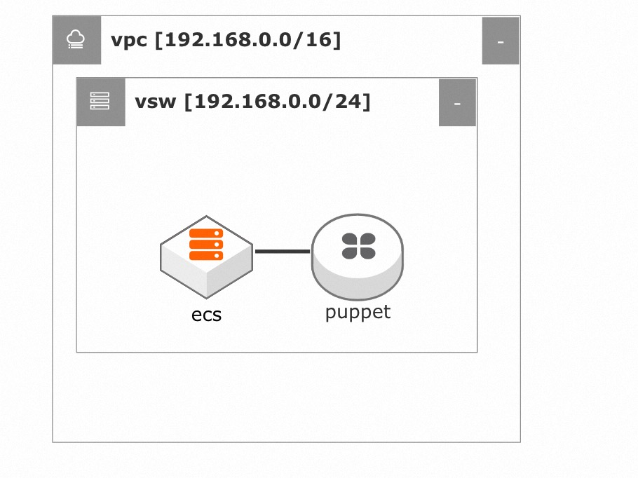
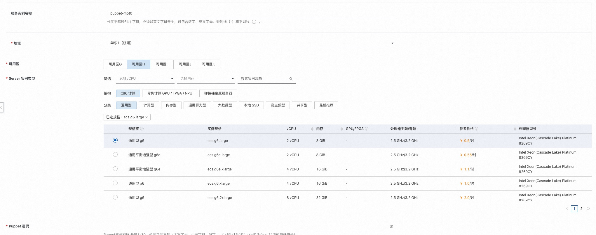
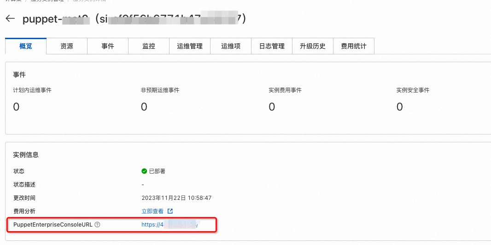
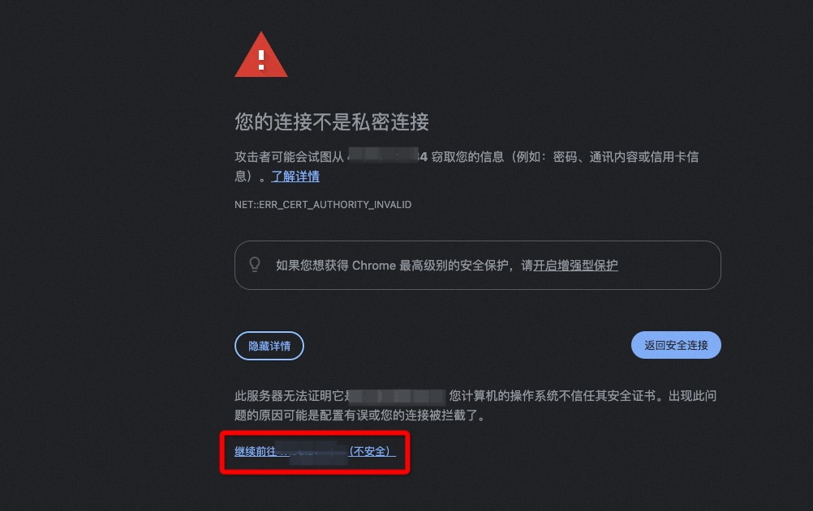
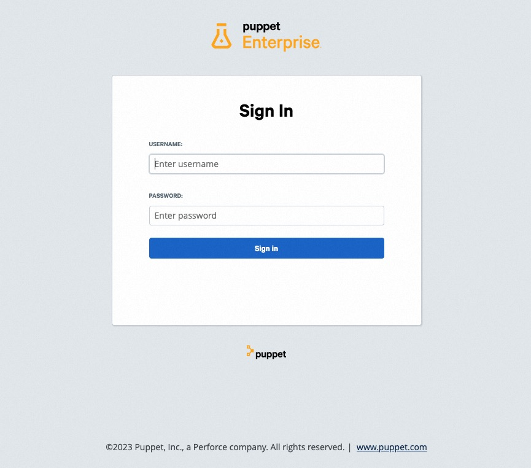
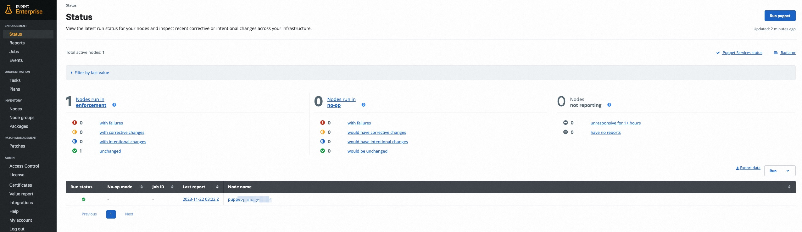

# Puppet Enterprise服务实例部署文档

> **免责声明：**
>
> 本服务由第三方提供，我们尽力确保其安全性、准确性和可靠性，但无法保证其完全免于故障、中断、错误或攻击。因此，本公司在此声明：对于本服务的内容、准确性、完整性、可靠性、适用性以及及时性不作任何陈述、保证或承诺，不对您使用本服务所产生的任何直接或间接的损失或损害承担任何责任；对于您通过本服务访问的第三方网站、应用程序、产品和服务，不对其内容、准确性、完整性、可靠性、适用性以及及时性承担任何责任，您应自行承担使用后果产生的风险和责任；对于因您使用本服务而产生的任何损失、损害，包括但不限于直接损失、间接损失、利润损失、商誉损失、数据损失或其他经济损失，不承担任何责任，即使本公司事先已被告知可能存在此类损失或损害的可能性；我们保留不时修改本声明的权利，因此请您在使用本服务前定期检查本声明。如果您对本声明或本服务存在任何问题或疑问，请联系我们。

## 概述

`Puppet`是适用于Linux、Unix和Windows系统的自动化管理引擎，它根据集中式规范执行管理任务（例如添加用户、安装软件包和更新服务器配置）。

本文向您介绍如何开通计算巢上的`Puppet`服务，以及部署流程和使用说明。

## 计费说明

`Puppet Enterprise`服务在计算巢上的费用主要涉及：

- 所选vCPU与内存规格
- 系统盘类型及容量
- 公网带宽

预估费用在创建实例时可实时看到。

## 部署架构

## RAM账号所需权限

Puppet服务需要对ECS、VPC等资源进行访问和创建操作，若您使用RAM用户创建服务实例，需要在创建服务实例前，对使用的RAM用户的账号添加相应资源的权限。添加RAM权限的详细操作，请参见[为RAM用户授权](https://help.aliyun.com/document_detail/121945.html)。所需权限如下表所示。

| 权限策略名称 | 备注 |
| --- | --- |
| AliyunECSFullAccess | 管理云服务器服务（ECS）的权限 |
| AliyunVPCFullAccess | 管理专有网络（VPC）的权限 |

## 部署流程

### 部署步骤

单击[部署链接](https://computenest.console.aliyun.com/service/instance/create/cn-hangzhou?type=user&ServiceId=service-4b2fa1cc215240d3819a)，进入服务实例部署界面，根据界面提示，填写参数完成部署。

### 部署参数说明

您在创建服务实例的过程中，需要配置服务实例信息。下文介绍云XR实时渲染平台服务实例输入参数的详细信息。

| 参数组 | 参数项 | 示例 | 说明 |
| -- | --- | --- | --- |
| 服务实例名称 |  | puppet | 实例的名称 |
| 地域 |  | 华北2（北京） | 选中服务实例的地域，建议就近选中，以获取更好的网络延时。 |
| 可用区 |  | 可用区 G | 地域下的可用区。 |
| Server 实例类型 |  | ecs.gn6i-c4g1.xlarge | ECS 实例规格，可以根据实际需求选择。 |
| Puppet 密码 |  | \*\*\*\*\*\*\*\*  | 登陆Puppet服务的密码。 |

### 验证结果

1. 查看服务实例。服务实例创建成功后，部署时间大约需要15分钟。部署完成后，可以在页面上获取`Puppet Enterprise Console`的登录地址。

2. 点击登录地址，进入登录界面。输入管理员用户名 `admin` 和参数中设置的Puppet登录密码，可以登录到Puppet Enterprise服务控制台。
   > 注意：您将收到有关证书不受信任的浏览器警告，您可以忽略此警告并接受证书，后续您可以绑定自己的域名并且设置对应的域名证书。

3. 登录成功后，您可以开始使用Puppet Enterprise服务。

## 帮助文档

请访问 Puppet Enterprise服务用户指南了解如何使用：[使用文档](https://www.puppet.com/docs/pe/2023.5/pe_user_guide.html)。
